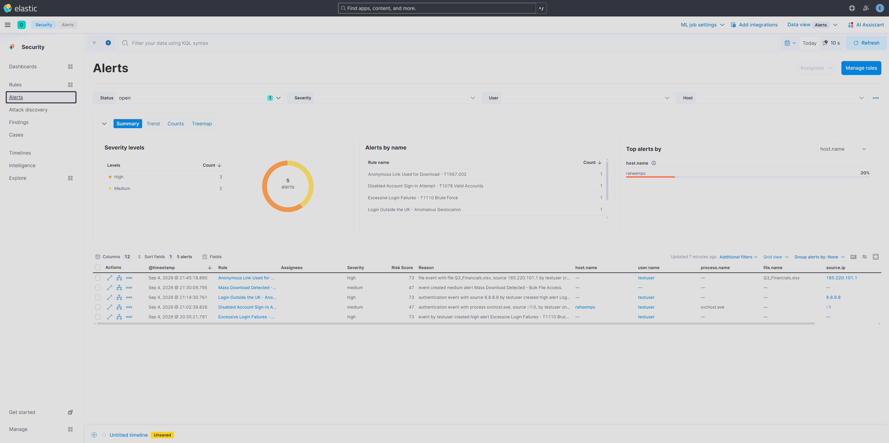
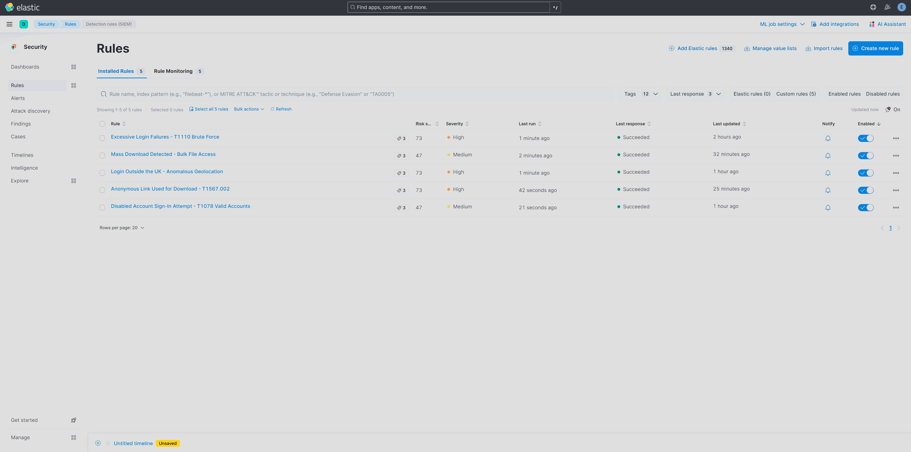
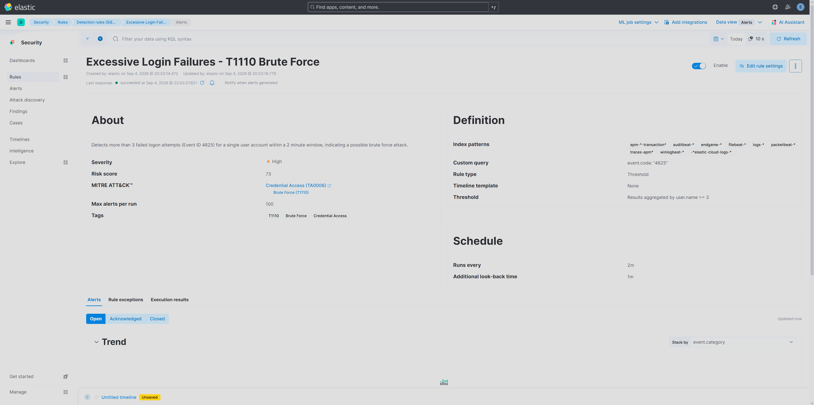
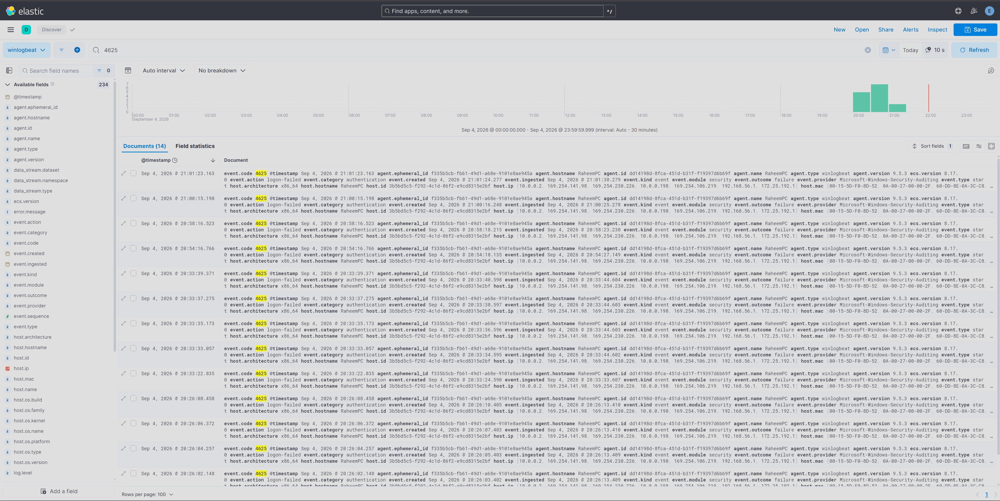
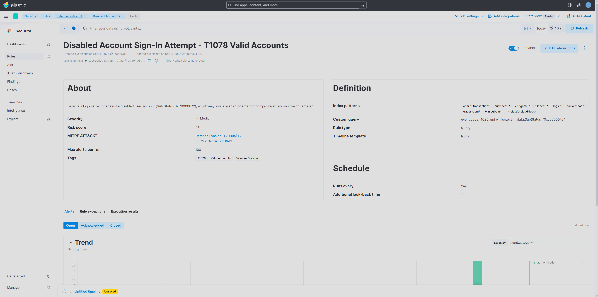
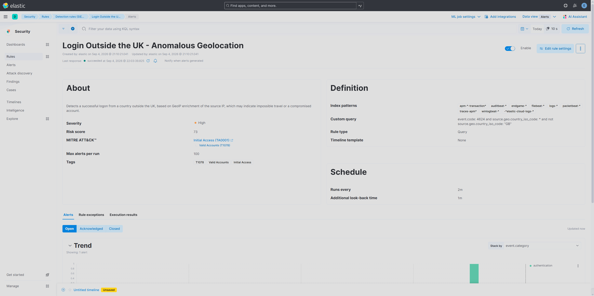
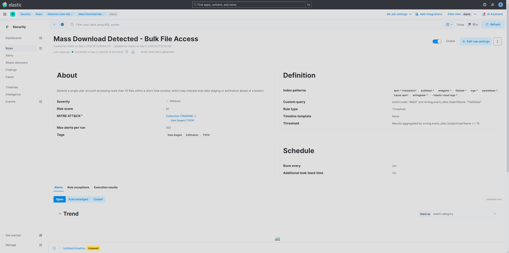
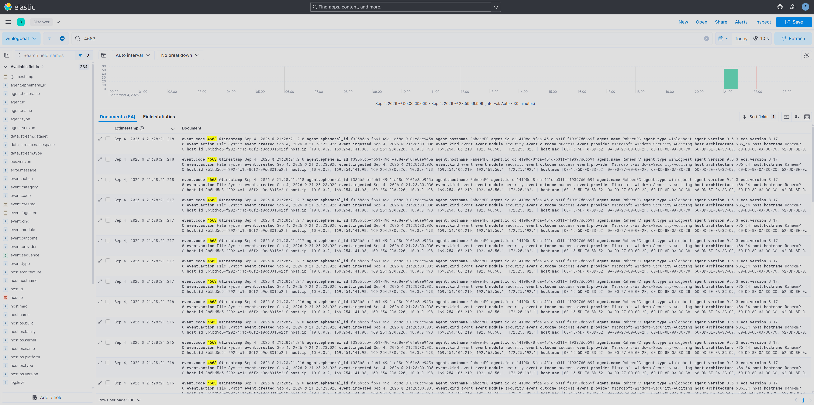
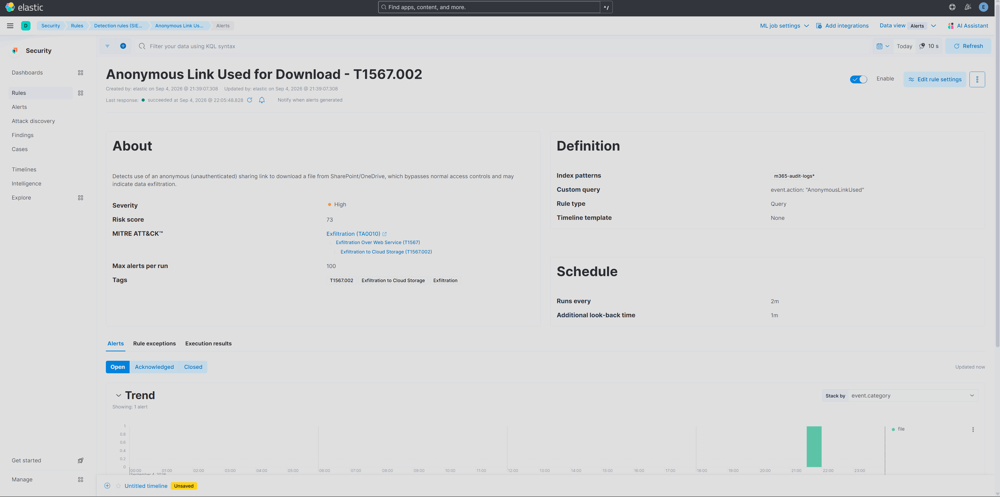
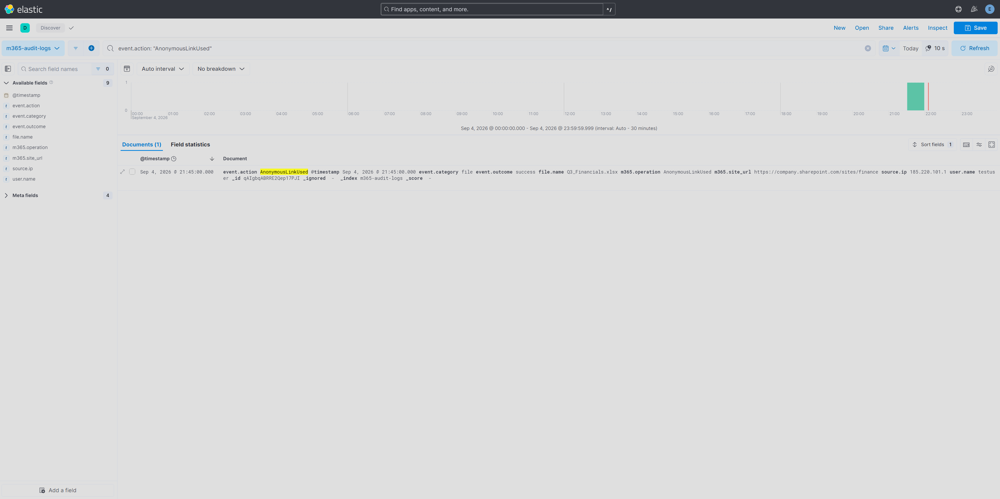

# ELK SIEM Detection Lab

A self-built SIEM using the Elastic Stack (Elasticsearch + Kibana + Winlogbeat), covering five real-world alert types end to end: real Windows Security event generation, detection rule engineering, MITRE ATT&CK mapping, and a security-hardened deployment.

Unlike a lot of home-lab writeups, every detection here fires against **genuine Windows Security events** generated through actual OS actions (failed logons, disabled account logon attempts, file access), not synthetic sample data. The two detections that needed data sources outside a single Windows PC (GeoIP-based anomalous login, M365 anonymous link sharing) use realistic simulated events built against the correct real-world log/field schema, the same technique detection engineers use to test rules for systems not yet in production.

## Architecture

```
Windows Security Event Log
        │
        ▼
   Winlogbeat (agent)
        │
        ▼
   Elasticsearch  ◄── GeoIP enrichment pipeline (for geolocation-based detection)
        │
        ▼
Elastic Security Detection Engine
        │
        ▼
   Alerts queue (severity, risk score, MITRE ATT&CK tagging)
```

Deployed via Docker (Elasticsearch + Kibana), with Winlogbeat installed natively as a Windows service shipping the Security, System, Application, and PowerShell event logs.


*The Alerts queue with all 5 detections fired: severity breakdown, risk scores, and per-user grouping, the same triage view a SOC analyst works from daily.*


*The Rules management page showing all 5 custom rules, their risk scores, severities, and healthy "Succeeded" execution status.*

**Security note:** the stack was deliberately rebuilt partway through with `xpack.security.enabled=true` after the initial (insecure) setup was caught during testing. Every alert below was built and verified on the authenticated, security-hardened version of the stack, since an unauthenticated SIEM backend isn't a realistic starting point for this kind of project.

## The Five Detections

| # | Detection | MITRE ATT&CK | Severity | Risk Score | Data Source |
|---|---|---|---|---|---|
| 1 | Excessive Login Failures (Brute Force) | [T1110](https://attack.mitre.org/techniques/T1110) — Credential Access | High | 73 | Real (Event ID 4625, threshold >3 in 2m) |
| 2 | Disabled Account Sign-In Attempt | [T1078](https://attack.mitre.org/techniques/T1078) — Defense Evasion | Medium | 47 | Real (Event ID 4625, Sub Status 0xC0000072) |
| 3 | Login Outside the UK (Anomalous Geolocation) | [T1078](https://attack.mitre.org/techniques/T1078) — Initial Access | High | 73 | Simulated + real GeoIP enrichment pipeline |
| 4 | Mass Download Detected (Bulk File Access) | [T1074](https://attack.mitre.org/techniques/T1074) — Collection | Medium | 47 | Real (Event ID 4663, object access auditing, threshold >10) |
| 5 | Anonymous Link Used for Download | [T1567.002](https://attack.mitre.org/techniques/T1567/002) — Exfiltration | High | 73 | Simulated M365 audit log event |

### 1. Excessive Login Failures — T1110 Brute Force
Generated real failed logons against a local test account using `System.DirectoryServices.AccountManagement.ValidateCredentials`. Detection rule: Elasticsearch threshold query, `event.code: 4625`, grouped by `user.name`, alerting when count exceeds 3 within a 2-minute window.




*The underlying evidence: real Windows Event ID 4625 entries generated by the test script, before the detection rule ever touches them.*

### 2. Disabled Account Sign-In Attempt — T1078
Windows only logs the specific "account disabled" sub-status (`0xC0000072`) on an *interactive* logon attempt with a *correct* password, a network logon with a wrong password returns a generic "bad credentials" message instead (a deliberate Windows anti-enumeration behaviour). Reproduced this correctly using `PSCredential` against a disabled account with its real password, confirmed via the raw Security event, then built the rule against the exact sub-status code.



### 3. Login Outside the UK — Anomalous Geolocation
Built a real Elasticsearch GeoIP ingest pipeline (`geoip` processor enriching `source.ip` → `source.geo`). Verified the pipeline resolves a known US IP correctly via the `_simulate` API, then indexed one realistic successful-logon event through that pipeline to confirm the detection rule (`event.code: 4624` + GeoIP present + country ≠ GB) fires correctly.



### 4. Mass Download Detected — Bulk File Access
Enabled Windows File System object access auditing (`auditpol` + a SACL applied via PowerShell's `FileSystemAuditRule`, since `icacls` does not support setting audit entries) on a dedicated test folder. Rapidly read 25 files in a single PowerShell loop to generate a genuine burst of Event ID 4663 entries, then built a threshold rule (>10 file reads by one user) to catch it.




*54 real Event ID 4663 object access entries generated by the bulk file-read script, well over the 10-file threshold.*

### 5. Anonymous Link Used for Download — T1567.002
This event type originates from Microsoft 365's unified audit log (`AnonymousLinkUsed` operation), not the Windows Security log, so it can't be generated locally. Built a document matching Microsoft's own documented schema for this event, indexed it into a dedicated `m365-audit-logs` index, and pointed the detection rule at that index specifically. Includes the full MITRE ATT&CK sub-technique chain (Exfiltration → Exfiltration Over Web Service → Exfiltration to Cloud Storage).




*The injected M365 audit event, shaped to match Microsoft's real `AnonymousLinkUsed` schema, correctly indexed into its own `m365-audit-logs` index.*

## Notable Problems Solved Along the Way

Building this surfaced several real infrastructure problems, not just "write a query and done":

- **Insecure-by-default deployment caught mid-build**: the initial Docker setup had `xpack.security.enabled=false`. Rebuilt the stack with authentication enabled, which then surfaced a second issue, Elastic Security's Detection Engine refuses to run under the `elastic` superuser account by design (it can't write to Kibana's internal system indices), requiring a dedicated `kibana_system` service account instead.
- **Field mapping mismatch**: an early alert message showed a blank username. Root cause was grouping on `user.name`, a field Winlogbeat doesn't always populate for 4625 events, the correct field for this event type is `winlog.event_data.TargetUserName`.
- **Windows anti-enumeration behaviour**: initial attempts to reproduce a disabled-account logon returned a generic bad-password error instead of the disabled-account code, because network logons don't reveal account status, only interactive logons with the correct password do. Diagnosed by reading the raw Security event sub-status directly rather than trusting the PowerShell error message alone.
- **Rule scheduling vs. historical timestamps**: several early tests appeared to silently fail because manually-injected or delayed test events fell outside the rule's lookback window by the time the rule actually ran, a real scheduling/timing consideration, not a broken rule.

## Skills Demonstrated

- Detection engineering with Elasticsearch (threshold queries, custom KQL, MITRE ATT&CK mapping)
- Log source onboarding and field normalization (Winlogbeat, ECS field mapping)
- Data enrichment pipeline design (GeoIP ingest pipeline, built and tested via the simulate API)
- Windows Security auditing configuration (logon auditing, object access/SACL auditing)
- SIEM platform security hardening (authentication, service accounts, RBAC)
- Root-cause troubleshooting across the full stack (Docker, Elasticsearch, Kibana, Windows auditing)
